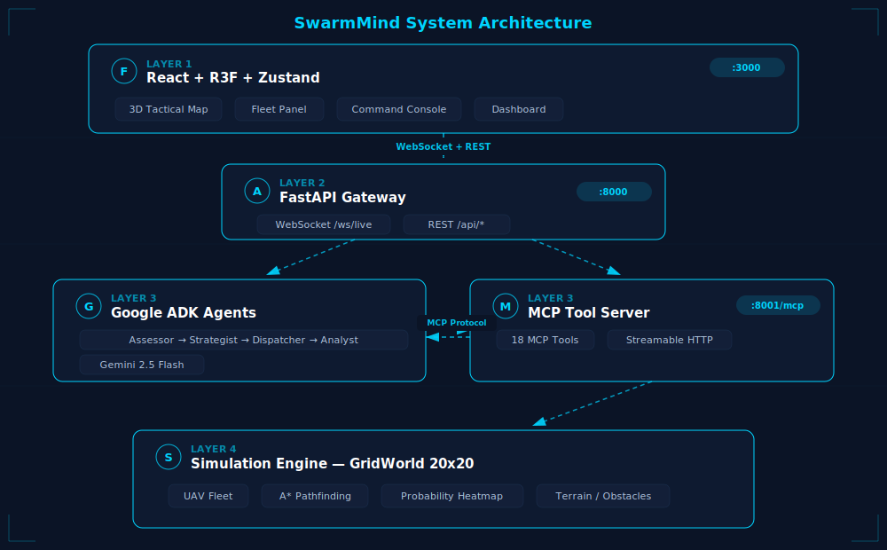
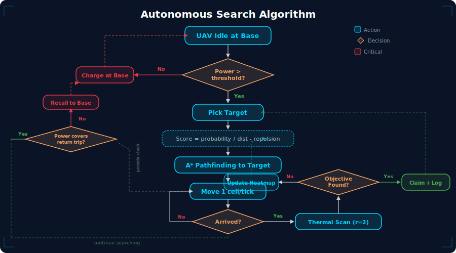
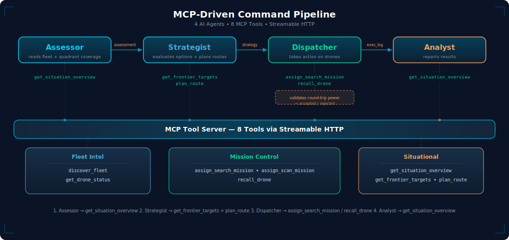
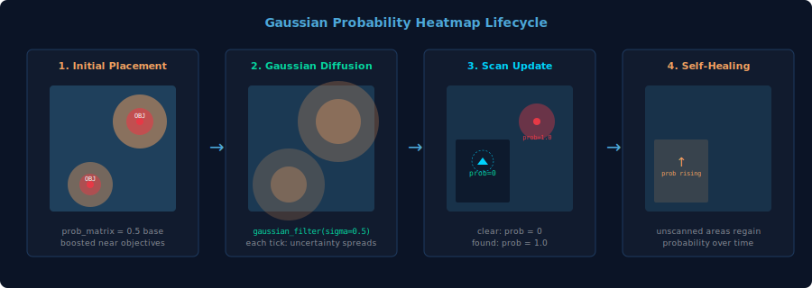
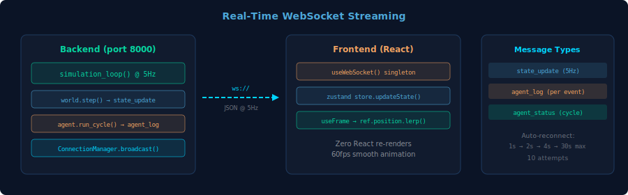

<div align="center">


<br/>

**When disaster strikes, every second costs lives. SwarmMind uses autonomous AI coordination to find survivors faster than any human dispatcher.**

<br/>

[](https://google.github.io/adk-docs/)
[](https://ai.google.dev/)
[](https://modelcontextprotocol.io/)
[](https://fastapi.tiangolo.com)

[](https://react.dev)
[](https://r3f.docs.pmnd.rs/)
[](https://python.org)
[](LICENSE)

---

[How It Works](#how-it-works) · [Architecture](#system-architecture) · [Drone Autonomy](#drone-autonomous-agents) · [MCP Tools](#mcp-tool-protocol) · [AI Pipeline](#ai-command-pipeline) · [3D Command Center](#3d-tactical-command-center) · [Quick Start](#quick-start)

</div>

---

## How It Works

SwarmMind is an **MCP-driven autonomous drone swarm command system** for search-and-rescue operations. Each drone is an **autonomous agent** — it flies, scans, avoids obstacles, and manages its own power. An AI commander (Google ADK + Gemini) provides **strategic coordination** across the fleet: spatial allocation, priority targeting, and relay strategies for reaching distant areas.

The system communicates through the **Model Context Protocol (MCP)** — the AI agent discovers and invokes drone control tools over a standard wire protocol, the same way a human operator would use a ground control station.

### What Makes It Different

| Traditional Approach | SwarmMind |
|---------------------|-----------|
| Human assigns each drone | AI reasons about optimal fleet deployment across map quadrants |
| Fixed search patterns | Probability-guided search with Gaussian diffusion heatmap |
| Direct function calls | MCP wire protocol — agent discovers 8 tools at runtime |
| No power awareness | Round-trip power validation; relay strategy for far targets |
| Text dashboards | 3D tactical map with React Three Fiber at 60fps |

---

## System Architecture

<div align="center">

</div>

SwarmMind is a **4-layer system**:

1. **Frontend** (React + R3F + zustand) — 3D tactical map, fleet panel, AI decision log, command console. Connected via WebSocket at 5 Hz.

2. **API Gateway** (FastAPI, port 8000) — WebSocket broadcast, REST mission control, static frontend hosting. MCP tool server runs on port 8001 in the same process.

3. **AI Agent Layer** (Google ADK + Gemini 2.5 Flash) — 4-stage sequential pipeline communicating with drones exclusively through MCP. Receives per-drone status, quadrant coverage, and frontier targets.

4. **Simulation Engine** — Configurable grid world with autonomous Drone agents, A* pathfinding, Gaussian probability heatmap, and terrain obstacles.

---

## Drone Autonomous Agents

<div align="center">

</div>

Each drone is a `Drone` class wrapping a `UAV` with autonomous behavior. Every tick, `drone.step()` runs:

1. **Safety check** — if power < return-trip cost, force return regardless of AI commands
2. **Charge gate** — block departure from base below 30% power
3. **Path advance** — move one cell with collision avoidance
4. **Path completion** — autopilot auto-scans; agent waits for next command
5. **Idle timeout** — release AI control after 10 ticks of inactivity
6. **Target selection** — score unexplored cells by probability, distance, and fleet repulsion

### Target Selection Scoring

```
score(cell) = (probability + 0.1) / sqrt(distance) - repulsion_weight * repulsion
```

- **probability** — Gaussian heatmap value (higher near likely survivors)
- **distance** — Manhattan distance from drone (closer is better)
- **repulsion** — inverse-square decay from other drones (prevents clustering)
- **power budget** — round-trip validated (outbound + return + safety margin)

### AI's Unique Value (what autopilot can't do)

- **Cross-drone spatial optimization**: "Alpha is east, send Bravo west"
- **Priority reasoning**: "Cell (15,18) probability 0.27 > cell (2,19) probability 0.12"
- **Relay strategy**: "Can't reach far corner in one trip — send to midpoint, recharge, push further"
- **Quadrant awareness**: "NE is only 30% covered, focus fleet there"

---

## MCP Tool Protocol

<div align="center">

</div>

SwarmMind exposes **8 mission-oriented MCP tools** over Streamable HTTP transport. The AI agent connects as an MCP client and discovers tools dynamically — no hardcoded drone IDs.

### 8 Tools

| # | Tool | Purpose |
|---|------|---------|
| 1 | `discover_fleet` | List all drones with status, power, position, mission |
| 2 | `get_drone_status` | Detailed single-drone telemetry with ETA and explorable cells |
| 3 | `assign_search_mission` | Send drone to target — validates round-trip power, returns accepted/rejected |
| 4 | `assign_scan_mission` | Thermal scan at current position — detects objectives, auto-claims |
| 5 | `recall_drone` | Return to base — rejected if already returning/charging |
| 6 | `get_situation_overview` | Complete picture: fleet, coverage, quadrants, hotspots, endurance |
| 7 | `get_frontier_targets` | Unexplored cells sorted by probability (top 20) |
| 8 | `plan_route` | A* route evaluation without executing — cost comparison |

### Why Mission-Oriented (not micro-tools)

The previous design had 13 micro-tools (`query_fleet`, `navigate_to`, `repower_uav`, etc.). The AI spent most of its time issuing redundant commands. The new 8 tools enforce:

- **Drone autonomy**: charging, scanning, and obstacle avoidance happen automatically
- **AI as strategist**: only decides *where* to send drones, not *how* to fly them
- **Power safety**: `assign_search_mission` rejects missions the drone can't afford

---

## AI Command Pipeline

The AI commander is a **4-stage sequential pipeline** built with Google ADK's `SequentialAgent`:

```
Assessor ──────> Strategist ──────> Dispatcher ──────> Analyst
  output:          output:           output:            output:
  "assessment"     "strategy"        "execution_log"    "report"

  get_situation    get_frontier      assign_search      get_situation
    _overview        _targets          _mission           _overview
  get_drone        plan_route        assign_scan
    _status                            _mission
                                    recall_drone
```

| Stage | Role | Example Decision |
|-------|------|-----------------|
| **Assessor** | Read situation + quadrants | "NE 30% covered, 3 drones idle at base, avg power 85%" |
| **Strategist** | Plan deployment | "Send Alpha to (12,15), Bravo to (8,18) — spread across NE quadrant" |
| **Dispatcher** | Execute missions | "assign_search_mission(Alpha, 12, 15) → accepted; (Bravo, 8, 18) → rejected: power insufficient → retry (Bravo, 5, 12) → accepted" |
| **Analyst** | Report results | "Coverage 45%→62%, 2 new missions assigned, NE improving" |

**Key behavior**: When `assign_search_mission` is rejected (insufficient power), the dispatcher retries with a **closer target** instead of giving up.

---

## Gaussian Probability Heatmap

<div align="center">

</div>

| Mechanism | Effect |
|-----------|--------|
| **Initial placement** | Objectives at random positions; probability boosted in radius-3 circle |
| **Gaussian diffusion** | Every tick: `gaussian_filter(sigma=0.5)` — uncertainty spreads over time |
| **Scan update** | Scanned cells → 0 (clear) or 1.0 (objective found) |
| **Obstacle mask** | Obstacle cells always 0 |

This creates a **self-healing priority map** — unscanned areas gradually increase in probability, driving drones to re-explore.

---

## 3D Tactical Command Center

The frontend renders a military operations aesthetic with React Three Fiber:

| Layer | What | How |
|-------|------|-----|
| **Terrain** | Ground + obstacles | Cached geometry, single draw call |
| **Coverage** | 400-cell instanced mesh | Color buffer updated per tick |
| **Fleet** | Octahedron markers | `lerp` in `useFrame` — zero React re-renders |
| **Objectives** | Pulsing red markers | Conditional render with rescue rings |
| **Post-FX** | Bloom + Vignette + Noise | 3-pass effect composer |

### Grid Color Legend

| Color | Meaning |
|-------|---------|
| Dark blue | Unexplored, low probability |
| Orange/red gradient | Unexplored, high probability hotspot |
| Dark green | Explored (scanned by drone) |
| Dark brown blocks | Obstacles (impassable) |
| Green cylinder | Base station (charging point) |

---

## Real-Time WebSocket Streaming

<div align="center">

</div>

State broadcast at **5 Hz** with auto-reconnect (exponential backoff: 1s→30s, 10 attempts).

Message types:
- `state_update` — full simulation state (fleet, coverage, objectives, heatmap)
- `agent_log` — AI reasoning, tool calls, tool results (streamed per event)
- `agent_status` — thinking/idle/error indicator

---

## Quick Start

### Prerequisites

- Python 3.12+ | Node.js 20+ | [Google API Key](https://aistudio.google.com/apikey)

### Setup

```bash
git clone https://github.com/SunflowersLwtech/SwarmMind.git
cd SwarmMind

# Python
pip install -r requirements.txt

# Frontend
cd frontend && npm install && npm run build && cd ..

# Configure
echo "GOOGLE_API_KEY=your_key_here" > .env
```

### Run

```bash
uvicorn backend.main:app --host 0.0.0.0 --port 8000
```

Open **http://localhost:8000** — click START.

The backend serves the frontend, runs the MCP tool server, and manages the AI agent pipeline — all in one process.

### Test

```bash
python -m pytest test/backend/ -v
# 249 passed
```

---

## Project Structure

```
SwarmMind/
  backend/
    main.py                    # FastAPI gateway + simulation loop + MCP server
    core/
      drone.py                 # Drone autonomous agent (step, assign_mission, pick_target)
      grid_world.py            # Environment engine (configurable grid, fleet property)
      uav.py                   # UAV model + Mission/MissionReport types
      terrain.py               # Obstacles + base position
      objective.py             # Gaussian probability heatmap
      pathplanner.py           # A* pathfinding wrapper
    services/
      tool_server.py           # 8 MCP tools (Streamable HTTP)
      fleet_connector.py       # Lifespan context
    agents/
      commander.py             # 4-stage SequentialAgent pipeline
      prompts.yaml             # Agent prompts with relay strategy
      runner.py                # AgentRunner with session rotation
    utils/
      blackbox.py              # Structured reasoning logs
  frontend/
    src/
      App.jsx                  # 3-column layout
      stores/missionStore.js   # zustand state management
      hooks/useWebSocket.js    # Auto-reconnect singleton
      scene/                   # R3F 3D components
      panels/                  # 2D UI panels (fleet, console, events)
  test/backend/                # 249 tests across 17 suites
  Dockerfile                   # Multi-stage build for deployment
  render.yaml                  # Render web service config
  .github/workflows/deploy.yml # CI/CD: test → deploy to Render
```

---

## Deployment

**Live**: [https://swarmmind.onrender.com](https://swarmmind.onrender.com)

CI/CD via GitHub Actions: push to `main` → run 249 tests → trigger Render deploy.

Docker multi-stage build: Node frontend → Python runtime → single container serving everything on one port.

---

## Tech Stack

| Layer | Technology | Role |
|-------|-----------|------|
| **Agent** | Google ADK + Gemini 2.5 Flash | 4-stage pipeline with McpToolset |
| **Protocol** | MCP (Streamable HTTP) | 8 mission-oriented tools |
| **Backend** | FastAPI + WebSocket | 5 Hz state broadcast + REST + MCP server |
| **Simulation** | NumPy + SciPy + pathfinding | Drone agents, heatmap, A* routing |
| **Frontend** | React Three Fiber + zustand | 3D tactical map, instanced rendering |
| **Styling** | Tailwind CSS | Dark military theme |
| **CI/CD** | GitHub Actions + Render | Auto-deploy on push to main |

---

## License

[MIT License](LICENSE)

<div align="center">

**Autonomous. Intelligent. Protocol-driven.**

<a href="https://google.github.io/adk-docs/"></a>
<a href="https://ai.google.dev/"></a>
<a href="https://modelcontextprotocol.io/"></a>
<a href="https://fastapi.tiangolo.com"></a>
<a href="https://r3f.docs.pmnd.rs/"></a>

</div>
